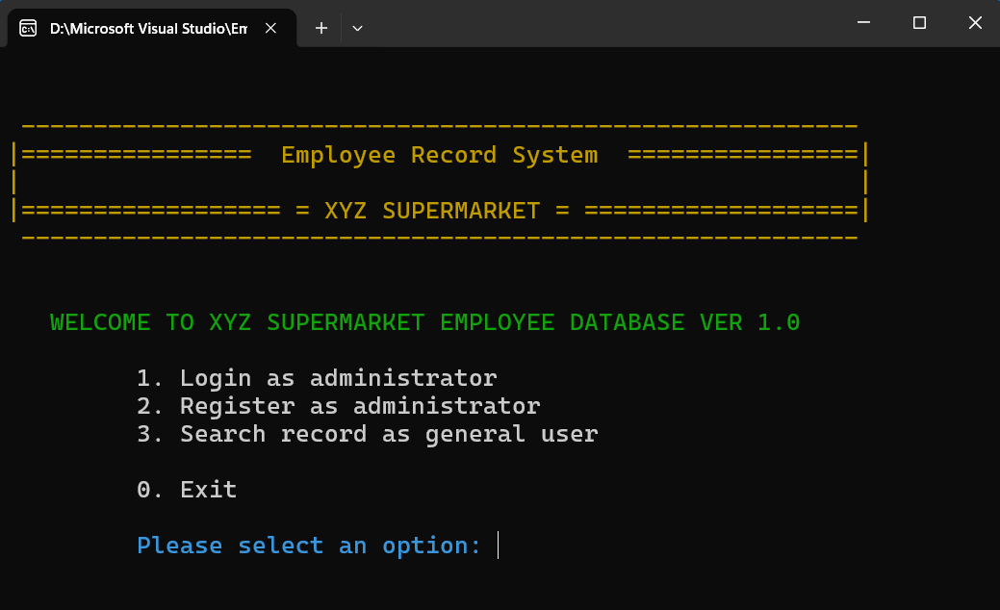
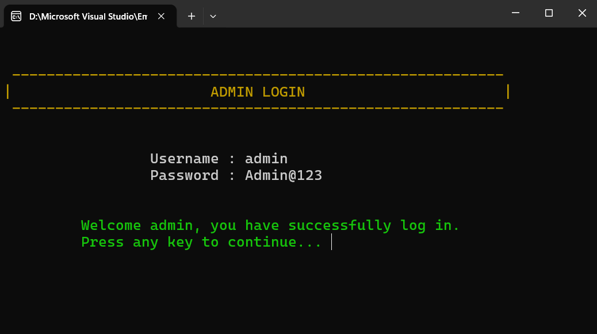
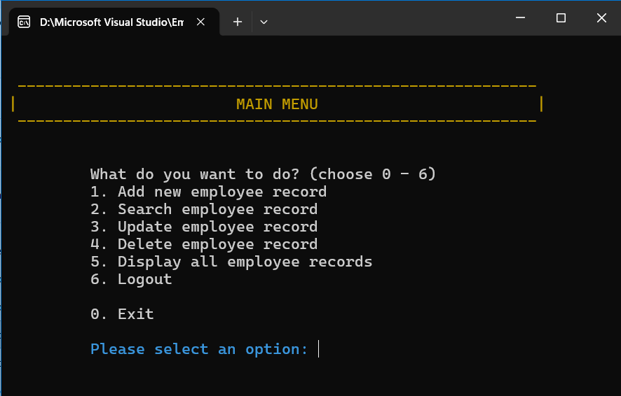
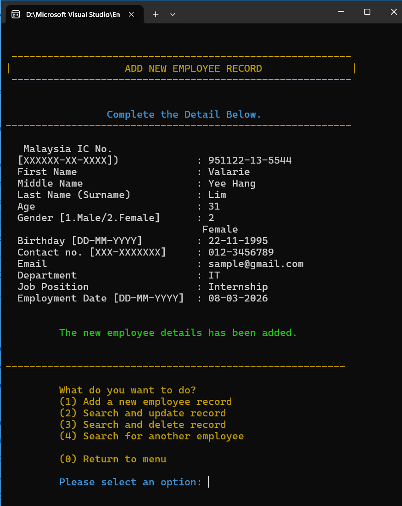
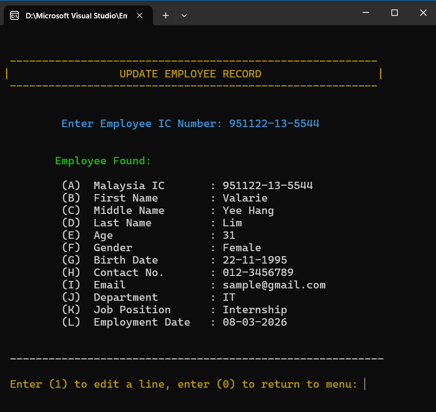
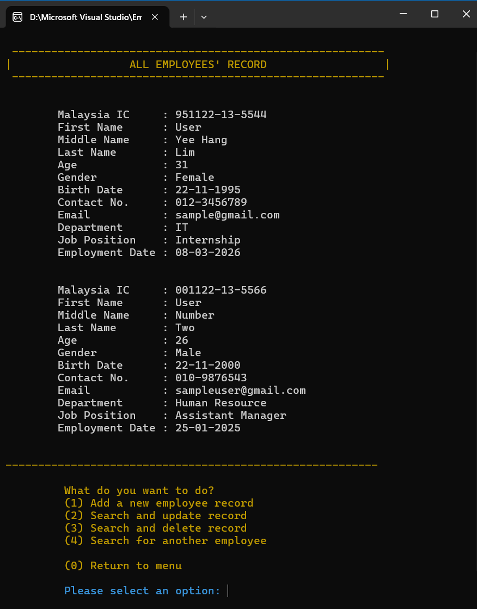

# Employee Record System

The Employee Record System is a console-based management system developed using C++.  
The system allows administrators to manage employee records through a menu-driven interface.

This project demonstrates basic database management concepts such as record creation, searching, updating, and deletion using file-based storage.

---

## Quick Start
1. Download EmployeeRecordSystem.zip
2. Extract the ZIP file
3. Open the folder
4. Run EmployeeRS.exe
5. Login using the default administrator account

---

## Default Administrator Login
To test the system with full access, use the following default credentials:

Username: admin  
Password: admin@123

Administrator access allows the following operations:

- Add employee records  
- Update employee records  
- Delete employee records  
- Display all employee records

General users can access limited features such as searching employee records.

---

## Project Overview
The purpose of this system is to simulate a simple employee management database used by an organization.

The system allows administrators to maintain employee records including personal details, department information, and employment records.

All data is stored in text files using file handling techniques in C++.

---

## System Features
### Authentication System
- Administrator login
- Administrator account registration
- Password reset functionality

### Employee Record Management
- Add new employee records
- Search employee records
- Update employee records
- Delete employee records
- Display all employee records

### General User Access
- Allow general users to search employee records
- Restricted access to modification features

### Input Validation
The system validates user input using regular expressions and input checks to ensure correct data format.

Examples:
- IC number format validation
- Contact number validation
- Email format validation
- Date format validation

---

## System Modules

The system consists of the following modules:

Authentication Module
- Login
- Registration
- Password reset

Employee Management Module
- Add employee record
- Search employee record
- Update employee record
- Delete employee record
- Display employee records

General User Module
- Search employee record without admin access

---

## Data Storage
The system uses **file-based storage** instead of a database.

Employee records are stored in:
employee_records.txt

Administrator login credentials are stored in:
Login_Records.txt

The program reads and writes data using C++ file handling (`fstream`).

---

## Technologies Used
- C++
- File handling (`fstream`)
- Regular expressions (`regex`)
- Console interface
- Menu-driven program structure

---

## Program Structure
The system is built using modular functions for different operations.  
Main functions include:  
login()  
registration()  
forgotPass()  
  
addRecord()  
displayRecord()  
searchRecord()  
updateRecord()  
deleteRecord()  
  
generalSearchRecord()  
menu()  
generalMenu()  
  
Employee information is stored using a C++ structure:  
struct Employee  

This structure contains employee details such as:
- IC number  
- Name  
- Age  
- Gender  
- Birthday  
- Contact number  
- Email  
- Department  
- Position  
- Employment date  
  
---

## System Requirements
- Windows operating system  
- No installation required  
  
Simply extract the ZIP file and run the executable file.  

---

## System Screenshots
### Main Menu

---

### Administrator Login

---

### Add Employee Record

---

### Search Employee Record

---

### Update Employee Record

---

### Display Employee Records

---

## Learning Outcomes
Through this project, I learned:
- File-based data storage using C++
- Implementation of CRUD operations
- Struct-based data modelling
- Input validation using regular expressions
- Modular programming and function design
- Utilisation of vector for dynamic data storing
- Menu-driven console application development

---

## Author
Valarie Lim  
Diploma in Information Technology
